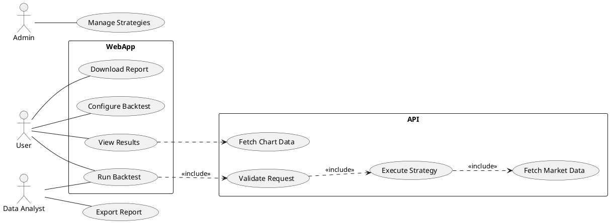
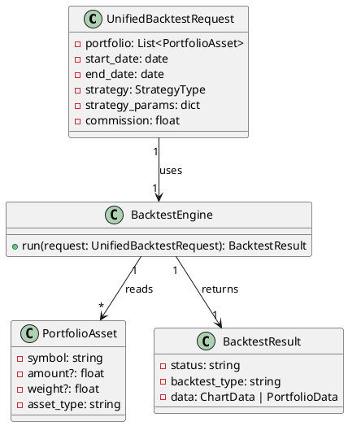
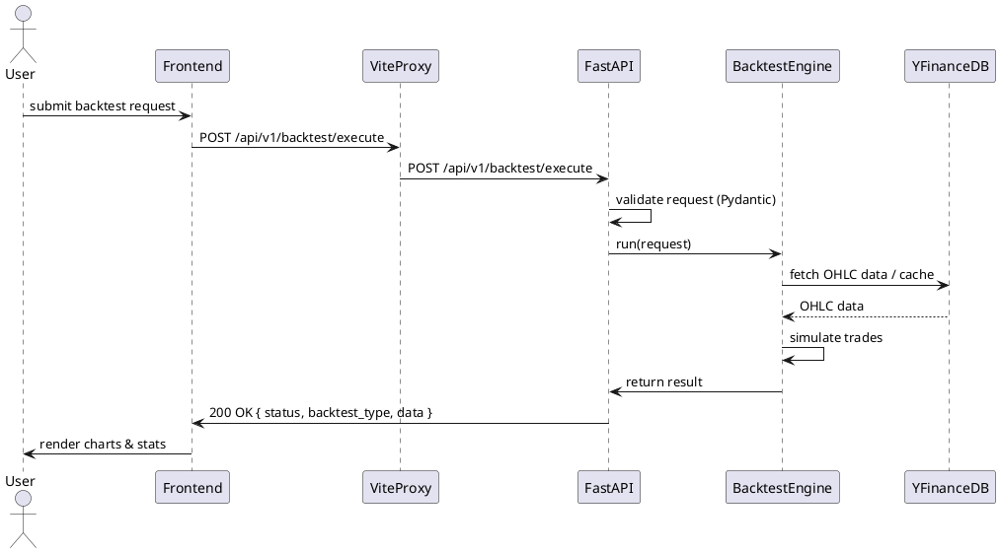

# Backtest Project — 상세 문서

이 문서는 Backtest 리포지토리의 전체 구조, 사용법, 개발 워크플로우, API 명세, 내부 아키텍처, 테스트 방법, 배포 및 디버깅 팁을 매우 상세하고 실무적으로 서술합니다. 초보자도 따라할 수 있도록 단계별 지침과 예제를 포함하고 있으며, 유지보수성과 협업을 고려한 규칙들을 정리했습니다.

목차
- 소개
- 빠른 시작(로컬 개발 환경)
  - 시스템 요구사항
  - Docker 기반 개발 (권장)
  - 개별 서비스 로컬 실행
- 프로젝트 구조 세부 설명
  - `backtest_be_fast/` (FastAPI)
  - `backtest_be_spring/` (Spring Boot)
  - `backtest_fe/` (React + Vite)
  - `compose/`, `database/`, `scripts/`
- 주요 데이터 흐름과 아키텍처
  - 백테스트 요청 흐름 (HTTP 요청 → CQRS → 서비스 → 저장소 → 응답)
  - 이벤트 및 비동기 처리 패턴
- API 명세(요약)
  - 공통 규칙 (날짜 포맷, 금액/수수료 범위 등)
  - `POST /api/v1/backtest/execute` (요청/응답 예시)
  - 기타 엔드포인트 요약 (`stock-data`, `exchange-rate`, `naver-news` 등)
- 프론트엔드: 구조, 컴포넌트, 훅, 스타일 가이드
  - 중요 컴포넌트(BacktestForm, BacktestResults, ChartsSection 등)
  - 커스텀 훅 규칙(`use*`), 테스트 위치
- 개발 규칙 및 코드 스타일
  - Python: PEP8, 타입힌트, black/isort
  - TypeScript/React: ESLint, Prettier, 2-space, 함수형 컴포넌트
  - Java(Spring): Java 17, 패키지 구조
- 테스트 전략
  - FastAPI: pytest(마커), 통합/유닛 테스트 권장 대상
  - Frontend: Vitest + React Testing Library, 훅/컴포넌트/서비스 테스트 예시
- CI/CD / 배포 가이드
  - Docker 이미지 구조, compose 파일 설명, 프로덕션 고려사항
- 디버깅 체크리스트(난이도별)
  - 네트워크/프록시 이슈, Pydantic validation, HMR 및 STOMP 연결 문제 등
- 운영 가이드(모니터링, 로그, LRU 캐시, DB 스냅샷)
- 기여 가이드(커밋 메시지, PR 템플릿, 리뷰 체크리스트)

---

소개
본 리포지토리는 투자 전략의 백테스트를 실행하고 시각화하는 툴입니다. 주요 목표는 다음과 같습니다:
- 빠른 실험: 전략 파라미터를 바꿔 빠르게 결과를 확인
- 재현 가능성: 동일한 입력으로 동일한 결과를 재생산 가능
- 생산성: 직관적인 UI와 효율적인 API 설계

빠른 시작(로컬 개발 환경)
시스템 요구사항
- Docker & Docker Compose
- Node.js (로컬 빌드 시)
- Python 3.11 (백엔드 테스트/개발용)

Docker 기반 개발(권장)
1. 레포지토리 루트에서 의존성 빌드 및 컨테이너 실행:

```bash
# 개발 환경 시작 (dev compose)
docker compose -f compose/compose.dev.yaml up -d --build
```

2. 서비스 포트
- 프론트엔드: `http://localhost:5173`
- FastAPI: `http://localhost:8000`
- Spring Boot: `http://localhost:8081`
- MySQL: `localhost:3307`
- Redis: `localhost:6379`

개별 서비스 로컬 실행(옵션)
- FastAPI 개발 서버
  ```bash
  cd backtest_be_fast
  pip install -r requirements.txt
  python run_server.py
  # 또는
  uvicorn app.main:app --reload
  ```

- Frontend 개발서버
  ```bash
  cd backtest_fe
  npm ci
  npm run dev
  ```

프로젝트 구조 세부 설명
- `backtest_be_fast/` — FastAPI로 작성된 백엔드 서비스(주요 비즈니스 로직)
  - `app/models/` — Pydantic request/response 모델
  - `app/services/` — 비즈니스 로직(백테스트 엔진, 차트 생성 등)
  - `app/cqrs/` — 명령/쿼리 핸들러
  - `app/repositories/` — DB/외부 데이터 접근
  - `app/events/` — 이벤트 및 핸들러

- `backtest_be_spring/` — Spring Boot 서비스 (커뮤니티, 인증, 실시간 채팅)
  - WebSocket/STOMP 구성 및 브로커

- `backtest_fe/` — React 프론트엔드
  - 주요 폴더: `features/backtest`, `shared`, `components`
  - `features/backtest` 내부에 `api`, `hooks`, `components`, `model` 등

주요 데이터 흐름과 아키텍처
- 백테스트 요청 플로우
  1. 프론트엔드에서 `POST /api/v1/backtest/execute` 요청
  2. FastAPI는 Pydantic 모델로 검증 후 CQRS 또는 서비스 레이어로 위임
  3. 서비스는 데이터(예: yfinance 연동 또는 DB 캐시)를 조회하고 백테스트 엔진 실행
  4. 결과를 요약 및 차트 데이터로 가공 후 응답

API 명세(요약)
- 공통 규칙
  - 날짜: `YYYY-MM-DD`
  - 수수료(commission): 0.0 ~ 0.1
  - 포트폴리오 합계: percent 형식일 경우 100±0.01 허용

- POST `/api/v1/backtest/execute`
  - 요청 예시:
    ```json
    {
      "portfolio": [{"symbol":"AAPL","amount":10000,"asset_type":"stock"}],
      "start_date": "2024-01-01",
      "end_date": "2024-06-01",
      "strategy": "rsi_strategy",
      "strategy_params": {"rsi_period": 14},
      "commission": 0.002
    }
    ```
  - 응답(통합형) 예시:
    ```json
    {
      "status": "success",
      "backtest_type": "single_stock",
      "data": {
        "ticker": "AAPL",
        "strategy": "rsi_strategy",
        "start_date": "2024-01-01",
        "end_date": "2024-06-01",
        "ohlc_data": [...],
        "equity_data": [...],
        "summary_stats": {...}
      }
    }
    ```

프론트엔드: 구조, 컴포넌트, 훅, 스타일 가이드
- 핵심 컴포넌트
  - `BacktestForm`: 사용자 입력(포트폴리오, 전략, 기간)
  - `BacktestResults`: 결과 요약 및 차트 렌더링
  - `ChartsSection`: OHLC, 누적 수익률, 거래표시 등
- 훅
  - `useBacktest`: 결과 관리, 오류/로딩 상태 관리
  - `useStockData`: 외부 주가 데이터 패칭
- 스타일 가이드
  - Tailwind CSS 사용
  - 컴포넌트는 유틸리티 클래스 중심, 재사용 가능한 UI primitives

개발 규칙 및 코드 스타일
- Python: black, isort, 타입힌트
- TypeScript/React: ESLint, Vitest, React Testing Library
- Commit 메시지 컨벤션(예: feat:, fix:, docs:, chore:)

테스트 전략
- FastAPI: `pytest -q` (유닛 테스트 및 통합 테스트 분리)
- Frontend: `npm run test:run` (Vitest 단위/통합)

디버깅 체크리스트
- 422 Validation: Pydantic 스키마 불일치(종목 symbol, amount 누락 등)
- 프록시: Vite dev server proxy 설정 확인
- WebSocket/STOMP: disconnect 시 InvalidStateError 방지

운영 가이드
- 모니터링: 로그 레벨, 각 서비스 헬스체크
- DB 백업 및 스냅샷 전략


UML 다이어그램
----------------
아래 섹션은 교수님들께 아키텍처와 설계를 설명하기 위한 UML 다이어그램과 상세 해설입니다. PlantUML 소스 블록을 포함하여 직접 렌더링하거나 슬라이드에 삽입해 사용할 수 있도록 구성했습니다.

1) 유스케이스 다이어그램 (Use Case)



설명:
- 주 사용자는 일반 사용자, 데이터 분석가(더 많은 권한으로 리포트 생성), 관리자가 있습니다.
- 주요 유스케이스는 전략 설정 → 백테스트 실행 → 결과 조회 → 리포트 다운로드입니다.
- `Validate Request`와 `Execute Strategy`는 내부적으로 CQRS/서비스 레이어로 분리되어 구현됩니다.

2) 컴포넌트 다이어그램 (Component)

```plantuml
@startuml
package "Frontend (Vite + React)" {
  [BacktestForm]
  [BacktestResults]
  [Charts]
}

package "API Gateway / Proxy" {
  [Vite Proxy]
}

package "Backtest Service (FastAPI)" {
  [HTTP Router]
  [Request Validators]
  [CQRS Service Manager]
  [Backtest Engine]
  [Chart Data Service]
  [Repositories]
}

package "Spring Services" {
  [Auth Service]
  [Community Service]
  [WebSocket / STOMP Broker]
}

[BacktestForm] --> [Vite Proxy]
[BacktestResults] --> [Vite Proxy]
[Vite Proxy] --> [HTTP Router]
[HTTP Router] --> [Request Validators]
[HTTP Router] --> [CQRS Service Manager]
[CQRS Service Manager] --> [Backtest Engine]
[Backtest Engine] --> [Repositories]
[Backtest Engine] --> [Chart Data Service]
[Backtest Results] ..> [Charts]

Auth Service --> [WebSocket / STOMP Broker]

@enduml
```

설명:
- 프론트엔드는 Vite dev-server의 proxy를 통해 API에 접근합니다. 운영환경에서는 API Gateway 또는 리버스 프록시를 사용합니다.
- FastAPI 앱은 요청을 검증한 뒤 CQRS 서비스 매니저로 위임하여 도메인 서비스(백테스트 엔진)를 실행합니다.

3) 클래스 다이어그램 (핵심 도메인)



설명:
- `UnifiedBacktestRequest`는 프론트엔드와 API 간의 계약입니다. `PortfolioAsset`은 amount 또는 weight 중 하나를 포함할 수 있으며, 서비스는 이를 표준화합니다.
- `BacktestEngine`은 도메인 엔티티와 외부 데이터(레포지토리)를 사용해 `BacktestResult`를 생성합니다.

4) 시퀀스 다이어그램 (백테스트 실행 플로우)



설명:
- 시퀀스는 검증, 데이터 패칭, 시뮬레이션, 결과 가공의 순서를 명확히 보여줍니다.
- 오류 발생 시(데이터 없음, validation error 등) FastAPI는 적절한 HTTP 상태(422, 404, 500)를 반환하며, 프론트엔드는 이를 사용자에게 표시합니다.

활용 팁
- PlantUML 텍스트는 `PROJECT_DOCS.md` 내부에 포함되어 있어 바로 렌더링 가능(예: VSCode PlantUML 확장, online plantuml 서버)
- 발표 자료에 포함할 때는 각 다이어그램 위에 핵심 메시지(유저 가치, 경계, 책임 분리)를 덧붙이세요.

기여 가이드
- PR 템플릿, 리뷰 체크리스트, 테스트 커버리지 목표

---

문서 끝.
